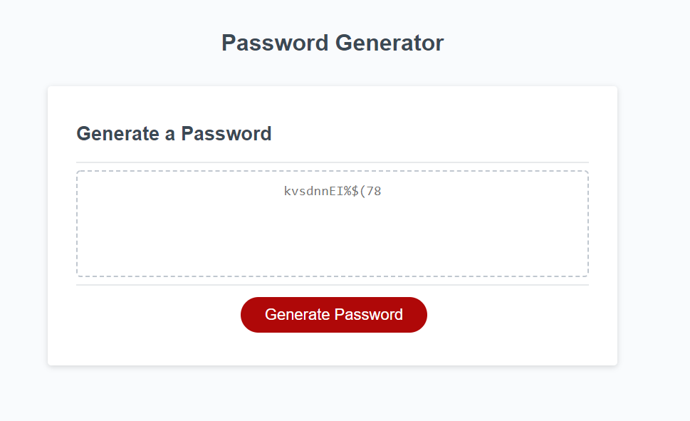

Project Description:
The purpose of this website is to allow user to create random generated secure passwords for their social medias and other apps and websites. 

Links: 
Github: https://github.com/ahsan13101994/password_generator
LiveSite: https://ahsan13101994.github.io/password_generator/

Preview:
password_generator\password_generatorapp.PNG
The following animation demonstrates the application functionality:

In the README include a project description, a link to the deployed website, and a screenshot of your application. The description allows the reader to understand your project, the link allows them to visit the site, and the screenshot is a preview of what they should expect.